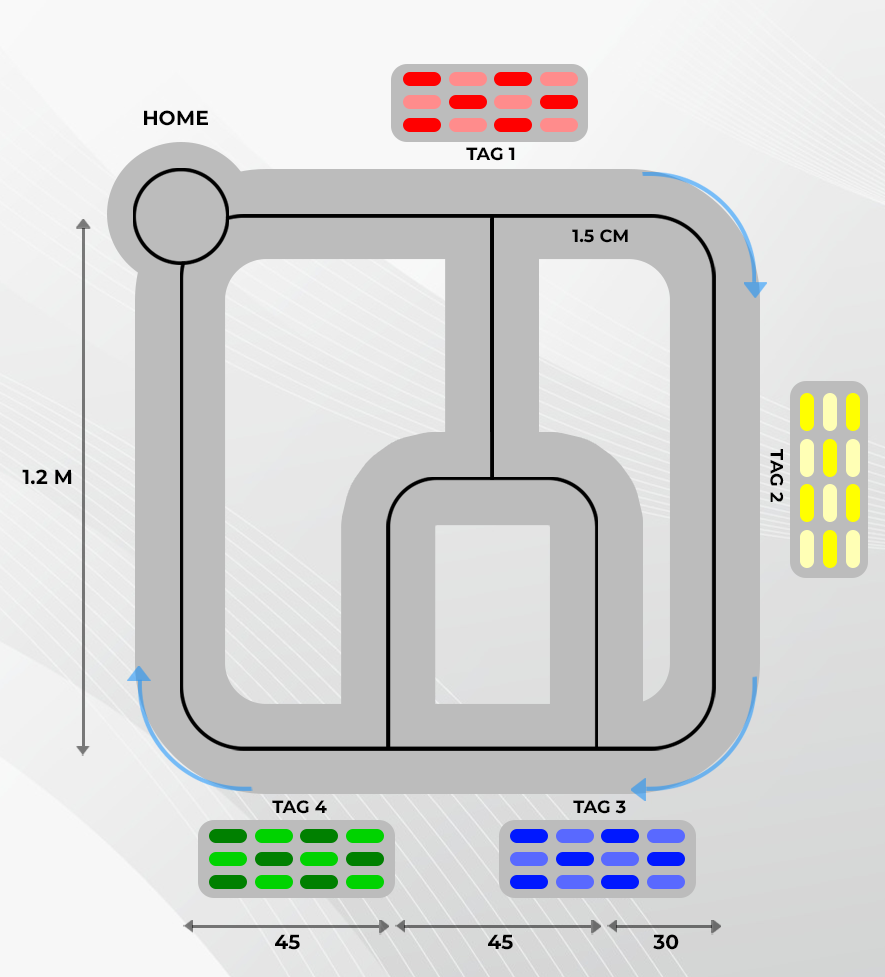

# Smart Warehouse Frontend

This is the frontend application for the Smart Warehouse system. It provides a user interface for monitoring and controlling the warehouse operations, including real-time visualization of robot activities and inventory management.

## Features

- Real-time monitoring of ESP32 robot status and location
- Inventory visualization with color-coded shelves
- Task assignment interface for product putaway and retrieval
- Queue management for pending tasks
- Firmware update management for ESP32 devices
- Responsive design for desktop and mobile use

## Technologies Used

- React (with TypeScript)
- Socket.IO Client for real-time communication
- Material-UI for components and styling
- React Router for navigation
- Redux for state management
- Axios for HTTP requests

## Installation

1. Clone the repository
2. Navigate to the frontend directory
3. Install dependencies:

```bash
npm install
```

4. Create a `.env` file (use `.env.template` as a reference):
```bash
cp .env.template .env
```

5. Edit the `.env` file with your specific configuration:
```
VITE_API_URL=http://localhost:3000/api
VITE_WEBSOCKET_URL=ws://localhost:3000
```

6. Start the development server:

```bash
npm run dev
```

## Environment Variables

Create a `.env` file with the following variables:

- `VITE_API_URL` - URL for the backend API
- `VITE_WEBSOCKET_URL` - WebSocket URL for real-time communication
- `VITE_AUTH_ENABLED` - Enable/disable authentication (true/false)

## Available Scripts

- `npm run dev` - Start the development server
- `npm run build` - Build the production application
- `npm run lint` - Run the linter
- `npm run test` - Run tests

## Directory Structure

- `/src/components` - React components
- `/src/pages` - Page components
- `/src/store` - Redux store configuration
- `/src/hooks` - Custom React hooks
- `/src/services` - API service functions
- `/src/utils` - Utility functions
- `/src/assets` - Static assets like images and icons

## Deployment

To build the application for production:

```bash
npm run build
```

The build files will be located in the `dist` directory and can be served by any static file server.

## 🌟 Features

### 1. Welcome Status Dashboard


The entry point of the application where users can:
- Select product zones (Red, Blue, Yellow, Green)
- Set product quantities
- View real-time queue status
- Monitor estimated waiting times

### 2. Main Dashboard


A comprehensive overview featuring:
- Real-time temperature monitoring across zones
- Inventory statistics and analytics
- Order processing status
- Performance metrics
- Interactive charts and graphs

### 3. Tracking System


Advanced tracking capabilities including:
- Real-time robot location tracking
- Zone monitoring
- Test mode for development
- Debug tools
- Connection status indicators

## 🚀 Technology Stack

- **Frontend Framework**: React 18
- **UI Library**: Material-UI (MUI)
- **State Management**: React Hooks
- **Routing**: React Router v7
- **Charts**: Nivo Charts
- **Styling**: Emotion/Styled Components
- **TypeScript**: For type safety

## 🛠️ Installation

1. Clone the repository:
```bash
git clone [your-repository-url]
```

2. Install dependencies:
```bash
npm install
```

3. Start the development server:
```bash
npm start
```

## 📦 Project Structure

```
src/
├── components/
│   ├── Dashboard.tsx
│   ├── Layout.tsx
│   ├── Tracking.tsx
│   └── WelcomeStatus.tsx
├── assets/
│   └── images/
├── services/
│   └── sensorService.ts
└── App.tsx
```

## 🎨 UI/UX Features

### Modern Design


- Dark mode optimized interface
- Gradient backgrounds
- Glassmorphism effects
- Responsive layout
- Smooth animations and transitions

### Interactive Elements


- Real-time data updates
- Interactive charts
- Hover effects
- Loading states
- Error handling

## 🔧 Configuration

The application can be configured through environment variables:

```env
VITE_API_URL=your_api_url
VITE_WEBSOCKET_URL=your_websocket_url
```

## 📱 Responsive Design



The application is fully responsive and works on:
- Desktop computers
- Tablets
- Mobile devices

## 🎯 Future Enhancements

- [ ] User authentication system
- [ ] Role-based access control
- [ ] Advanced analytics dashboard
- [ ] Mobile application
- [ ] API integration with warehouse management systems
- [ ] Real-time notifications
- [ ] Multi-language support

## 🤝 Contributing

1. Fork the repository
2. Create your feature branch (`git checkout -b feature/AmazingFeature`)
3. Commit your changes (`git commit -m 'Add some AmazingFeature'`)
4. Push to the branch (`git push origin feature/AmazingFeature`)
5. Open a Pull Request

## 📝 License

This project is licensed under the MIT License - see the [LICENSE](LICENSE) file for details.

## 👥 Authors

- Smart Warehouse Team - Initial work

## 🙏 Acknowledgments

- Material-UI team for the amazing component library
- React team for the fantastic framework
- Socket.IO team for the real-time communication library

---

Made with ❤️ by [Your Name]


